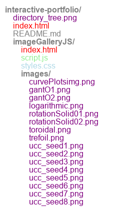

A repository showcasing interactive projects, including an image gallery with JavaScript, hosted on GitHub Pages. 
Features dynamic tools, educational resources, and systems engineering solutions. 

https://johnryanzelling.github.io/interactive-portfolio/ 

### About  
- Licensed substitute teacher currently pursuing an MA in Teaching Mathematics (expected 2027). 
- Experienced in oilfield operations, surveying, and technical design. 

---

### Research Interests  
- Mathematics education.  

---

### Education  
- **MA in Teaching Mathematics** (in progress), Valley City State University 2027
- **Certificate in Electrical Engineering Technology**, Pellissippi State Community College 2016
- **M.S. Systems Engineering**, National University 2012  
- **A.S. Building Information Technology**, College of Southern Nevada 2007
- **B.S. Mathematics**, Allegheny College 1999

---

### Professional Positions  
- Substitute Teacher, Williston Middle and High Schools  
- Freelance Hot Oil & Hazmat Chemical Operator  

---

### Publications and Projects  

---

### Teaching Experience  
- Middle and High School Mathematics (Williston Schools)  
- Private tutoring in mathematics and technical skills  

---

### Field and Laboratory Experience  
- Oilfield operations, including hot oil and hazmat chemical handling.  

---

### Languages  
- **English**: Fluent  
- **Spanish**: Conversational  

---

### Some Projects  
- **Generative Art**  
- **Gantt Charts**  
- **Curve Plots**  

## Project Gallery

---

### How to Reach Me  
- **LinkedIn:** [linkedin.com/in/johnryanzelling/](https://www.linkedin.com/in/johnryanzelling/)  

---

### Note on Projects  
*All repositories are private.*

